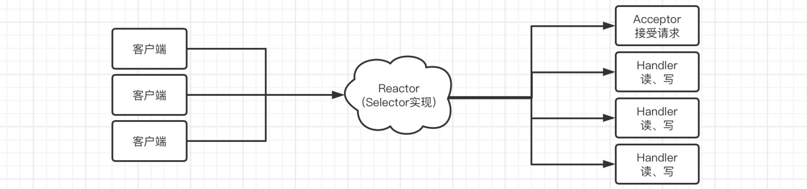
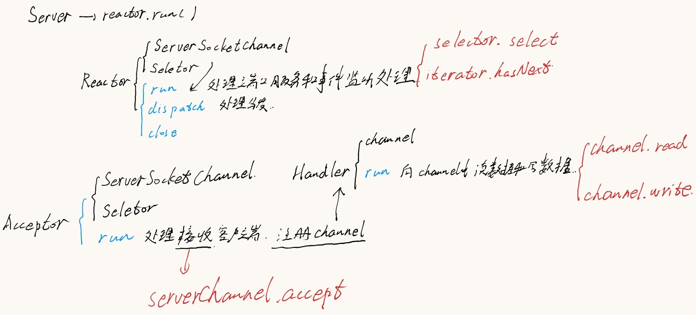

# MultiplexingReactor
Reactor模式实现多路复用

> 这里补充说明一下，将一个文件夹用idea打开想要将该文件夹注册为项目，需要首先在左边栏目中右键删除该模块，而不是右键模块设置，设置是针对该模块进行设置，然后打开右边的小齿轮创建模块，选好路径即可。

> 注意两个Server类的冲突，测试的时候需要删掉一个。

## selector实现多路复用

既然我们现在需要实现IO多路复用，那么我们来看看常见的IO多路复用模型，也就是Selector的实现方案，比如现在有很多个用户连接到我们的服务器：

* **select**：当这些连接出现具体的某个状态时，只是知道已经就绪了，但是不知道详具体是哪一个连接已经就绪，每次调用都进行线性遍历所有连接，时间复杂度为`O(n)`，并且存在最大连接数限制。
* **poll**：同上，但是由于底层采用链表，所以没有最大连接数限制。
* **epoll**：采用事件通知方式，当某个连接就绪，能够直接进行精准通知（这是因为在内核实现中epoll是根据每个fd上面的callback函数实现的，只要就绪会会直接回调callback函数，实现精准通知，但是只有Linux支持这种方式），时间复杂度`O(1)`，Java在Linux环境下正是采用的这种模式进行实现的。

### Server.java

```java
import java.io.IOException;
import java.net.InetSocketAddress;
import java.nio.ByteBuffer;
import java.nio.channels.SelectionKey;
import java.nio.channels.Selector;
import java.nio.channels.ServerSocketChannel;
import java.nio.channels.SocketChannel;
import java.util.Iterator;
import java.util.Set;

// 这里有一个隐式声明，需要将最上面的package移除

public static void main(String[] args) {
  try (ServerSocketChannel serverChannel = ServerSocketChannel.open();
       Selector selector = Selector.open()) {
    serverChannel.bind(new InetSocketAddress(8080));
    serverChannel.configureBlocking(false);
    serverChannel.register(selector, SelectionKey.OP_ACCEPT);
    while (true) {
      int count = selector.select();
      System.out.println("监听到 " + count + " 个事件");
      Set<SelectionKey> selectionKeys = selector.selectedKeys();
      Iterator<SelectionKey> iterator = selectionKeys.iterator();
      while (iterator.hasNext()) {
        SelectionKey key = iterator.next();
        if (key.isAcceptable()) {
          System.out.println("here1");
          SocketChannel channel = serverChannel.accept();
          System.out.println("客户端已连接，IP地址为：" + channel.getRemoteAddress());
          channel.configureBlocking(false);
          channel.register(selector, SelectionKey.OP_READ);
        } else if (key.isReadable()) {
          System.out.println("here2");
          SocketChannel channel = (SocketChannel) key.channel();
          ByteBuffer buffer = ByteBuffer.allocate(128);
          channel.read(buffer);
          buffer.flip();
          System.out.println("接收到客户端数据：" + new String(buffer.array(), 0, buffer.remaining()));
          channel.write(ByteBuffer.wrap("已收到！".getBytes()));
        }
        iterator.remove();
      }
    }
  } catch (IOException e) {
    throw new RuntimeException(e);
  }
}
```

> 服务端注意selectionKeys，itetator和key

### Client.java

```java
import java.io.IOException;
import java.net.InetSocketAddress;
import java.nio.ByteBuffer;
import java.nio.channels.SocketChannel;
import java.util.Scanner;

public static void main(String[] args) {
  try (SocketChannel channel = SocketChannel.open(new InetSocketAddress("localhost", 8080));
       Scanner scanner = new Scanner(System.in)){
    System.out.println("已连接到服务端！");
    while (true) {
      System.out.println("请输入要发送给服务端的内容：");
      String text = scanner.nextLine();
      channel.write(ByteBuffer.wrap(text.getBytes()));
      System.out.println("已发送！");
      ByteBuffer buffer = ByteBuffer.allocate(128);
      channel.read(buffer);
      buffer.flip();
      System.out.println("收到服务器返回："+new String(buffer.array(), 0, buffer.remaining()));
    }
  } catch (IOException e) {
    throw new RuntimeException(e);
  }
}
```

> 本身还是很简单的，客户端需要做的处理其实并不多

## reactor实现多路复用

> 相比于selector来说更加规范，也更加java（面向对象）

前面我们简单实现了多路复用网络通信，我们接着来了解一下Reactor模式，对我们的服务端进行优化。

现在我们来看看如何进行优化，我们首先抽象出两个组件，Reactor线程和Handler处理器：

* Reactor线程：负责响应IO事件，并分发到Handler处理器。新的事件包含连接建立就绪、读就绪、写就绪等。
* Handler处理器：执行非阻塞的操作。

实际上我们之前编写的算是一种单线程Reactor的朴素模型（面向过程的写法），我们来看看标准的写法：



也就是将之前的Server拆分为多个部件，每个部件各司其职。

### Server.java

```java
import org.mobai.reactor.Reactor;

import java.io.IOException;

public static void main(String[] args) {
  try (Reactor reactor = new Reactor()){
    reactor.run();
  }catch (IOException e) {
    e.printStackTrace();
  }
}
```

### Reactor.java

```java
package org.mobai.reactor;

import java.io.Closeable;
import java.io.IOException;
import java.net.InetSocketAddress;
import java.nio.channels.SelectionKey;
import java.nio.channels.Selector;
import java.nio.channels.ServerSocketChannel;
import java.util.Iterator;
import java.util.Set;

public class Reactor implements Closeable, Runnable{

  private final ServerSocketChannel serverChannel;
  private final Selector selector;
  public Reactor() throws IOException {
    serverChannel = ServerSocketChannel.open();
    selector = Selector.open();
  }
	// 创建两个内部变量，并且在对象初始化的时候就实现变量的初始化
  
  @Override
  public void run() {
    try {
      serverChannel.bind(new InetSocketAddress(8080));
      serverChannel.configureBlocking(false);
      serverChannel.register(selector, SelectionKey.OP_ACCEPT, new Acceptor(serverChannel, selector));
      while (true) {
        int count = selector.select();
        System.out.println("监听到 "+count+" 个事件");
        Set<SelectionKey> selectionKeys = selector.selectedKeys();
        Iterator<SelectionKey> iterator = selectionKeys.iterator();
        while (iterator.hasNext()) {
          this.dispatch(iterator.next());
          iterator.remove();
        }
      }
    }catch (IOException e) {
      e.printStackTrace();
    }
  }

  private void dispatch(SelectionKey key){
    Object att = key.attachment();
    if(att instanceof Runnable) {
      ((Runnable) att).run();
    }
  }
  // 分发执行run

  @Override
  public void close() throws IOException {
    serverChannel.close();
    selector.close();
  }
}
```

### Acceptot.java

```java
package org.mobai.reactor;

import java.io.IOException;
import java.nio.channels.SelectionKey;
import java.nio.channels.Selector;
import java.nio.channels.ServerSocketChannel;
import java.nio.channels.SocketChannel;

public class Acceptor implements Runnable{

  private final ServerSocketChannel serverChannel;
  private final Selector selector;

  public Acceptor(ServerSocketChannel serverChannel, Selector selector) {
    this.serverChannel = serverChannel;
    this.selector = selector;
  }

  @Override
  public void run() {
    try{
      SocketChannel channel = serverChannel.accept();
      System.out.println("客户端已连接，IP地址为："+channel.getRemoteAddress());
      channel.configureBlocking(false);
      channel.register(selector, SelectionKey.OP_READ, new Handler(channel));
    }catch (IOException e){
      e.printStackTrace();
    }
  }
}
```

### Handler.java

```java
package org.mobai.reactor;

import java.io.IOException;
import java.nio.ByteBuffer;
import java.nio.channels.SocketChannel;

public class Handler implements Runnable{

  private final SocketChannel channel;

  public Handler(SocketChannel channel) {
    this.channel = channel;
  }

  @Override
  public void run() {
    try {
      ByteBuffer buffer = ByteBuffer.allocate(128);
      channel.read(buffer);
      buffer.flip();
      System.out.println("接收到客户端数据："+new String(buffer.array(), 0, buffer.remaining()));
      channel.write(ByteBuffer.wrap("已收到！".getBytes()));
    }catch (IOException e){
      e.printStackTrace();
    }
  }
}
```

> 两个Server的实现基本类似，关于这个Server的体系结构如下



> 大体思路是这样的，注意Reactor中的dispatch这个方法的实现
<<<<<<< HEAD
=======

上面是单个线程的实现方式，多线程实现如下；修改Handler.java即可

```java
package org.mobai.reactor;

import java.io.IOException;
import java.nio.ByteBuffer;
import java.nio.channels.SocketChannel;
import java.util.concurrent.ExecutorService;
import java.util.concurrent.Executors;

public class Handler implements Runnable{
  private static final ExecutorService POOL = Executors.newFixedThreadPool(10);
  private final SocketChannel channel;
  public Handler(SocketChannel channel) {
    this.channel = channel;
  }

  @Override
  public void run() {
    try {
      ByteBuffer buffer = ByteBuffer.allocate(1024);
      channel.read(buffer);
      buffer.flip();
      POOL.submit(() -> {
        try {
          System.out.println("接收到客户端数据："+new String(buffer.array(), 0, buffer.remaining()));
          channel.write(ByteBuffer.wrap("已收到！".getBytes()));
        }catch (IOException e){
          e.printStackTrace();
        }
      });
    } catch (IOException e) {
      throw new RuntimeException(e);
    }
  }
}
```

> 改动不大，就是用线程池的方式来处理SocketChannel的read和write

后面关于创建Reactor线程池子即SubReactor的方式见原文档，这里不做具体展开。
